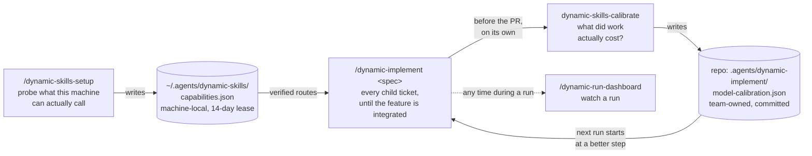
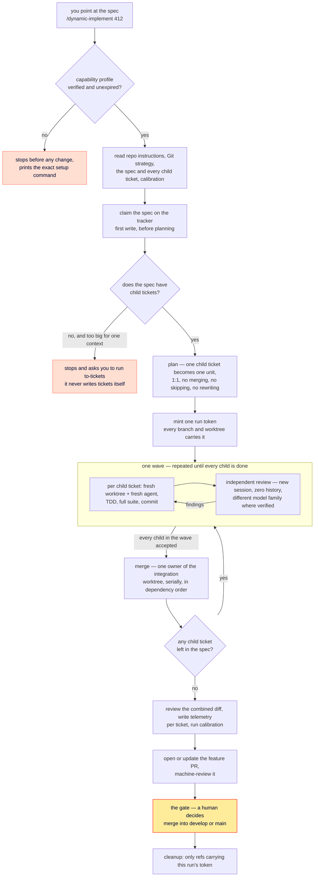

# Phassle skills

[](https://skills.sh/phassle/skills)

Agent skills I use to run AI coding agents efficiently — starting with what they silently cost. Built at [Monterro](https://www.monterro.com), shared so my colleagues (and you) can use them too.

Skills in this repo are small, auditable, and work across harnesses: Claude Code first, with fallbacks for Codex, GitHub Copilot, and other Agent-Skills-standard agents.

## Quickstart (30-second setup)

1. Run the skills.sh installer:

```bash
npx skills@latest add phassle/skills
```

2. Pick the skills you want and which agents to install them to.

3. Run `/tokenomics` in your agent. It analyzes your usage history and publishes an interactive report — removal candidates, live token savings, and one apply-prompt per harness.

## Install as a Claude Code plugin

Prefer a managed install you don't maintain by hand? These skills also ship as a native [Claude Code plugin](https://code.claude.com/docs/en/plugins) — a read-only bundle that updates when a new version ships.

Inside Claude Code:

```
/plugin marketplace add phassle/skills
/plugin install phassle-skills@phassle
```

Or from your shell:

```bash
claude plugin marketplace add phassle/skills
claude plugin install phassle-skills@phassle
```

Two ways to install, two philosophies:

- **[skills.sh](https://skills.sh/phassle/skills)** copies the skills into your project so you can hack on them and make them your own.
- **The plugin** keeps them as an always-current bundle you don't edit — best when you just want the set to work and follow along as it evolves.

> Using Codex or another agent? The skills.sh installer puts these skills into Codex, Copilot, and other Agent-Skills-standard harnesses today. The skills detect which harness they run in and adapt (for example, tokenomics writes its report to a local HTML file where Claude's Artifact hosting isn't available).

## Why these skills exist

### #1: You pay for context you never use

**The problem.** Every session of Claude Code (or Codex, or Copilot) starts by loading plugins, skills, agent definitions, MCP schemas, and memory files into context — before you type a single character. That overhead rides along with *every message*, at real token prices. Most setups accumulate tools that are never invoked: a plugin installed for one demo, an MCP server from a POC, a skill pack that seemed useful. Nothing tells you they're still costing you.

**The fix** is **[/tokenomics](./skills/productivity/tokenomics/SKILL.md)**. It reads your actual session transcripts — every skill invocation, agent call, slash command, and MCP call you have ever made — and scores everything installed against real usage. The result is an interactive report:

- Removal candidates ranked by cost, with a live token-savings counter
- An "installed globally" inventory of everything your account loads
- Config tips per harness — model defaults, subagent models, thinking budgets, compaction, junk-read blocking — each verified against official docs
- A scope choice (this project only, or global user settings), then one ready-to-run apply-prompt per harness


Nothing changes automatically. The report generates prompts; you read them, then run them in the harness they belong to.

Run it once, clean up, then re-run monthly — `/usage` in Claude Code shows spend per skill and plugin, and tokenomics turns that into decisions.

### #2: The limit isn't the model, it's the context window

**The problem.** A feature that spans eight files does not fail because the model is too weak. It fails because one conversation carries the plan, every file it touched, every test run, every review comment and every fix — and by the last unit the beginning has been compacted away. Review is worse: an agent that just wrote the code is the worst possible reviewer of it, because its reasoning is still in the window.

**The fix** is the `dynamic-*` set: you point at a spec and its child tickets are worked off one at a time. Each work unit gets a fresh worktree and a fresh agent with zero conversation history, hands back commits and artifacts instead of conversation, and is reviewed by a separate agent — preferably on a different model family — that never sees how the code was written. Four skills, each doing one job:



Two stores, deliberately separate: what *this machine* can call is local and expires; what *the team learned* about cost is committed to the repo and travels.

#### The order, and why

**1. `/dynamic-skills-setup` — once per machine, then when it expires.** It probes each harness with a tiny live session and records only what answered: exact model ids, exact effort values, which routes can host an independent review. Anything merely advertised is parked where nothing can route work to it. Each harness's catalog is leased for 14 days, after which that harness alone is re-probed.

Run it by hand. It cannot be triggered by the model and `dynamic-implement` will never invoke it for you — it spends real credits on probes, so it asks for approval and stays a visible action you chose.

**2. `/dynamic-implement <spec>` — once per feature.** This is the workhorse. You point it at the parent spec, not at a ticket, and it works off every child ticket underneath until the feature is integrated. The spec and its children have to be actually specified: observable outcome, acceptance criteria, product decisions already made. Invoked without an issue it orients instead — reads the repo, tracker and any interrupted run, tells you what it would do next, and stops without touching anything.

**3. `dynamic-skills-calibrate` — mostly not by you.** `dynamic-implement` runs it automatically before opening the PR, scoped to that feature. Run it by hand only periodically after integration, or when routing feels wrong — too weak, too slow, too expensive.

> **You cannot calibrate before your first run.** Calibration reads telemetry from *completed* issues, so on a fresh repo there is nothing to learn from. The first run uses the default boundary (`small → T1`, `medium → T2`, `large → T3`) and every run after it starts closer to the cheapest step that actually gets work accepted. Running calibrate first is not wrong, it is simply a no-op.

**4. `/dynamic-run-dashboard` — whenever you want to see it.** One page at a stable path for a run in flight; re-run it to refresh.

#### What one run actually does

You point at **one spec** — the parent issue. Every child ticket under it is then worked off, one unit each, until the whole feature is integrated:



One spec in, one feature PR out — not one PR per ticket. The loop keeps going until every child is verifiably integrated, and the feature PR cannot become ready while one is unresolved.

Everything up to the gate runs without asking you to manage it — a failing check, a dead agent, a model at capacity and a review finding are all things to recover from. The gate is the one hard stop: no initial instruction authorises a merge into `develop` or `main`, not "run autonomously", not "finish it". Authorisation is a new decision from you, made *after* the evidence is on the table. A machine review is evidence, never approval.

#### One ticket? Use Matt Pocock's skills directly

This set is for the automatic case: a spec whose children you want worked off without babysitting each one. It is the wrong tool for a single ticket — the planning, run token, worktree fan-out, tracker claims and integration branch are all overhead you don't need.

| What you have | Use |
| --- | --- |
| One ticket, or a change you can hold in one head | Matt Pocock's `implement` (and `/tdd`, `/code-review`) directly, in your normal session |
| A spec with child tickets, or one too big for a single context | `/dynamic-implement <spec>` |
| A spec with no children yet | Matt Pocock's `to-tickets` first, then `/dynamic-implement <spec>` |

`dynamic-implement` never replaces those skills — it invokes them. Each unit runs Matt's `implement` workflow unchanged, and every review is his `code-review` in a clean context. What this set adds is the orchestration around them: which ticket runs when, on which model, in which worktree, reviewed by whom, and merged in what order.

#### So why not just run `/dynamic-implement` directly?

You can — and after the one-time setup, that is exactly what you do. It is the only one of the four you run per feature. The other three exist because of what `implement` refuses to guess:

| If you skip | What happens | Why it works that way |
| --- | --- | --- |
| **setup** | `implement` stops before its first write and prints the exact setup command for your harness | An installed CLI is not a callable model. Routing a unit to a model that turns out to be unavailable wastes a whole attempt, and finding out mid-run is expensive |
| **calibrate** | Nothing breaks; every run starts at the default boundary | It only has something to say once runs have completed. It is the feedback loop, not a prerequisite |
| **the dashboard** | Nothing breaks | It is a window into a run, never part of it |

The deeper answer: the two support skills exist so `implement` can be **evidence-driven instead of optimistic**. Setup replaces "this model probably works" with a live probe. Calibration replaces "the small model is cheaper" with measured cost-to-acceptance — every attempt a route consumed, including the retries and re-reviews a too-weak model forces. A step that is cheap per token and needs three passes is dearer than the strong step that lands it in one.

## Reference

Skills split on one axis — who can invoke them. **User-invoked** skills are reachable when you type them (e.g. `/tokenomics`); **model-invoked** skills can also be reached automatically by the agent when a task fits.

### Productivity

General workflow tools, not tied to one codebase.

**User-invoked**

- **[tokenomics](./skills/productivity/tokenomics/SKILL.md)** — Audit what your AI coding setup loads into context vs what you actually use, from your own transcripts. Publishes an interactive report with removal candidates, per-harness config tips (Claude Code, Codex CLI, GitHub Copilot), and one apply-prompt per harness.

### In development

How they fit together, and in what order to run them, is explained in [#2 above](#2-the-limit-isnt-the-model-its-the-context-window). These are installable through skills.sh — they appear under **General** in the picker — but they are **not** in the plugin bundle and their contracts still change between commits. Install them if you want to follow along; don't build on them yet.

- **[dynamic-implement](./skills/other/dynamic-implement/SKILL.md)** — Takes one spec-level issue end to end: plans it into units, builds each under TDD in its own worktree, reviews every unit in a clean context on a different model family, integrates, and updates the tracker. No single context window holds the whole build.
- **[dynamic-skills-setup](./skills/other/dynamic-skills-setup/SKILL.md)** — Probes which harnesses, models and effort levels are actually callable on this machine (Codex, Claude Code, Copilot, OpenCode, Pi) and writes a verified capability profile. An installed binary is not a callable model, so nothing is taken on trust.
- **[dynamic-skills-calibrate](./skills/other/dynamic-skills-calibrate/SKILL.md)** — Rebuilds the repo's model-and-effort routing profile from what past runs actually produced, so routing gets cheaper or stronger based on outcomes rather than assumptions.
- **[dynamic-run-dashboard](./skills/other/dynamic-run-dashboard/SKILL.md)** — Publishes one page for a run in flight: what is being built, which model built and reviewed each unit, what each model cost in agents, turns and time, and what the run learned. Same design system as the tokenomics report, no shared files between them.
- **dynamic-qa** — a [specification](./skills/other/dynamic-qa/SPEC.md) only. Nothing to invoke yet.
