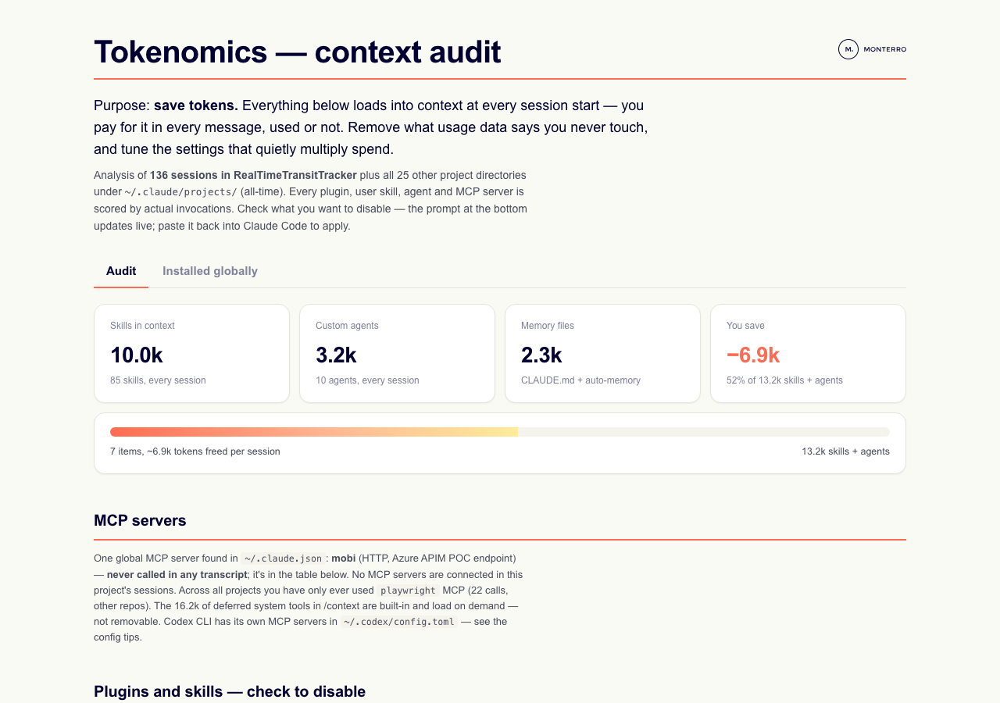
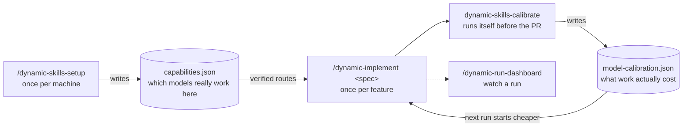
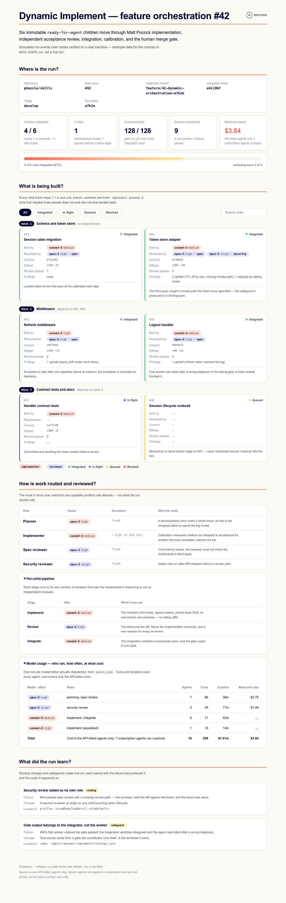
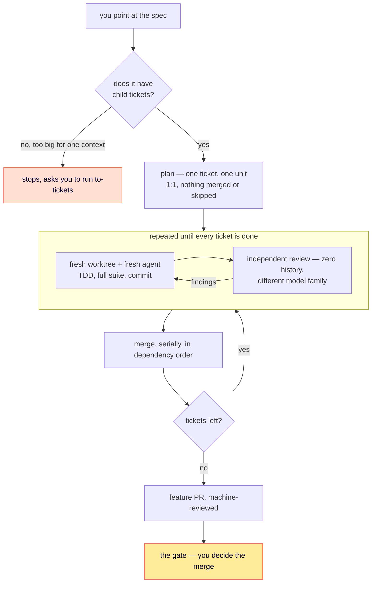

# Phassle skills

[](https://skills.sh/phassle/skills)

Agent skills for running AI coding agents efficiently — starting with what they silently cost. Built at [Monterro](https://www.monterro.com).

Works in Claude Code, Codex, GitHub Copilot, and other Agent-Skills harnesses.

## Install

```bash
npx skills@latest add phassle/skills
```

Pick the skills you want and which agents to install them to. That's it.

<details>
<summary>Or install as a managed Claude Code plugin</summary>

```bash
claude plugin marketplace add phassle/skills
claude plugin install phassle-skills@phassle
```

**skills.sh** copies the skills into your project so you can edit them. **The plugin** keeps them as an always-current bundle you don't touch.

</details>

## `/tokenomics` — stop paying for context you never use

Every session loads plugins, skills, agents and MCP schemas before you type anything, on every message. Most of it is never invoked.

`/tokenomics` reads your own transcripts, scores everything installed against real usage, and publishes a report: removal candidates, a live token-savings counter, config tips per harness, and one copy-paste prompt to apply it. It changes nothing itself.



## `dynamic-*` — point at a spec, get a PR

You point at a parent spec. Every child ticket under it gets its own worktree and its own fresh agent, is reviewed by a *different* agent that never saw the code being written, and is merged into one feature PR.

**It builds on a cheap model on purpose.** Tickets start on the smallest verified model step and only escalate when one actually fails. The big model is spent where it pays — planning the split, and reviewing the result. Runs on your existing subscription login; no API key needed.

Two commands you actually run:

```bash
/dynamic-skills-setup           # once per machine
/dynamic-implement 412          # once per feature
```



`/dynamic-run-dashboard` gives you one page for the run — every child ticket per wave, who built and reviewed each one, what each model cost, and what the run learned:



<sub>Rendered from [`example-run.json`](./skills/other/dynamic-run-dashboard/references/example-run.json) — simulated events, real verified routes.</sub>

<details>
<summary><b>What one run does</b> — spec in, child tickets worked off, one PR out</summary>



Everything up to the gate is autonomous — failing checks, dead agents, review findings are recovered from. Merging into `develop` or `main` always needs a fresh decision from you, after the evidence. A machine review is evidence, never approval.

</details>

<details>
<summary><b>When not to use it</b>, and what the other two skills are for</summary>

| What you have | Use |
| --- | --- |
| One ticket | Matt Pocock's `implement` directly — the orchestration is pure overhead |
| A spec with child tickets | `/dynamic-implement <spec>` |
| A spec with no children yet | `to-tickets` first, then `/dynamic-implement <spec>` |

`dynamic-implement` invokes Matt Pocock's `implement`, `tdd` and `code-review` unchanged; it adds only the orchestration around them. Both stores exist so it stops guessing: **setup** proves which models this machine can actually call (an installed CLI is not a callable model), and **calibrate** measures what a route really cost to get work *accepted*, retries and re-reviews included. Skip setup and the run stops before its first write with the exact command to fix it. Skip calibrate and nothing breaks — it has nothing to learn from until runs have completed.

</details>

## Reference

**Released** — in the plugin bundle.

- **[tokenomics](./skills/productivity/tokenomics/SKILL.md)** — context audit → interactive report → apply-prompt per harness. User-invoked.

**In development** — installable via skills.sh, under **General** in the picker. Not in the plugin; contracts still move.

- **[dynamic-implement](./skills/other/dynamic-implement/SKILL.md)** — one spec end to end: plan, per-ticket worktrees, clean-context review, integrate, PR.
- **[dynamic-skills-setup](./skills/other/dynamic-skills-setup/SKILL.md)** — probe which harnesses, models and effort levels are really callable here.
- **[dynamic-skills-calibrate](./skills/other/dynamic-skills-calibrate/SKILL.md)** — learn the cheapest model step that gets work accepted.
- **[dynamic-run-dashboard](./skills/other/dynamic-run-dashboard/SKILL.md)** — one page for a run in flight: units, models, cost, lessons.
- **dynamic-qa** — [spec](./skills/other/dynamic-qa/SPEC.md) only, nothing to invoke yet.
